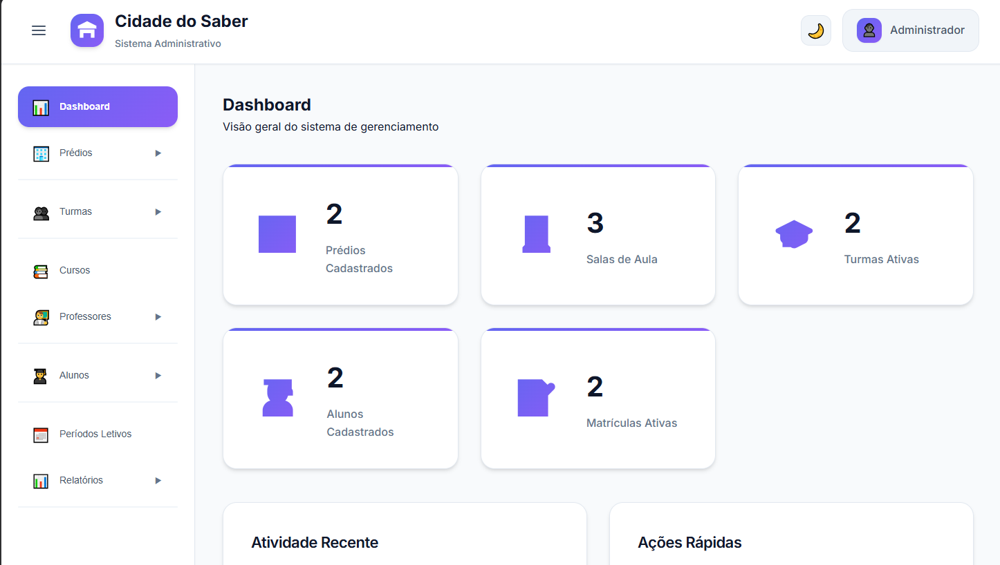
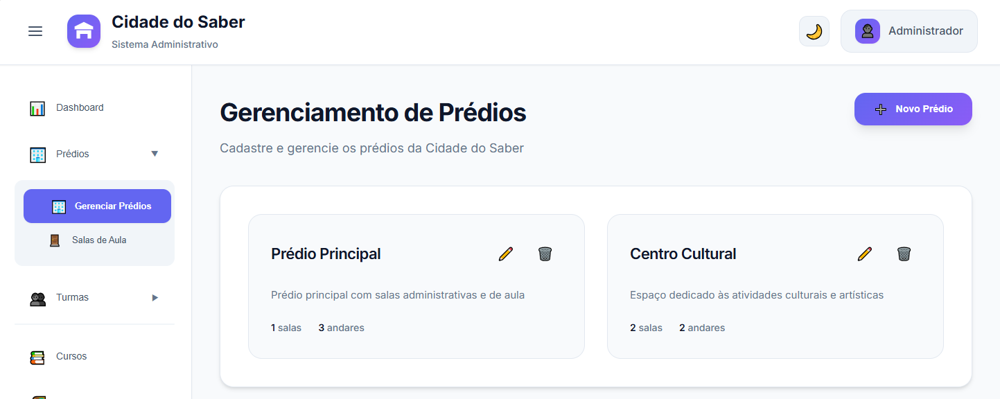
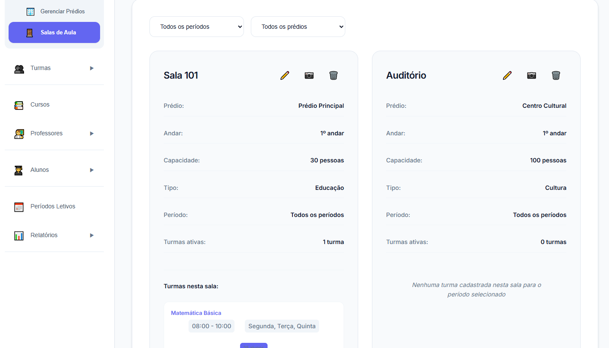
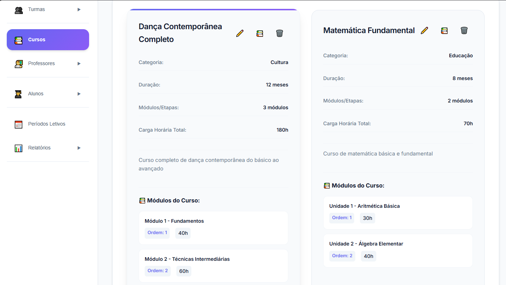

# 🎓 Sistema de Gerenciamento de Cursos

Um sistema completo para gerenciamento de cursos, turmas, alunos e matrículas, desenvolvido com tecnologias web modernas.


## 📋 Índice

- [Sobre o Projeto](#sobre-o-projeto)
- [Funcionalidades](#funcionalidades)
- [Tecnologias Utilizadas](#tecnologias-utilizadas)
- [Instalação](#instalação)
- [Como Usar](#como-usar)
- [Estrutura do Projeto](#estrutura-do-projeto)
- [Contribuição](#contribuição)
- [Licença](#licença)

## 🎯 Sobre o Projeto

O Sistema de Gerenciamento de Cursos é uma aplicação web desenvolvida para facilitar a administração de instituições de ensino. O sistema permite o controle completo de cursos, turmas, alunos e matrículas, oferecendo uma interface intuitiva e funcionalidades robustas para gestão acadêmica.

### ✨ Principais Características

- **Interface Moderna**: Design responsivo e intuitivo
- **Gestão Completa**: Controle total de cursos, turmas e alunos
- **Sistema de Senhas**: Geração automática de senhas para matrículas
- **Relatórios**: Impressão de listas de alunos e frequência
- **Validações**: Sistema robusto de validação de dados
- **Persistência**: Dados salvos localmente no navegador

## 🚀 Funcionalidades

### 📚 Gerenciamento de Cursos
- ✅ Cadastro de cursos com informações detalhadas
- ✅ Edição e exclusão de cursos
- ✅ Visualização de lista completa de cursos
- ✅ Validação de dados obrigatórios

### 🏫 Gerenciamento de Turmas
- ✅ Criação de turmas vinculadas a cursos
- ✅ Definição de capacidade, horários e local
- ✅ Controle de vagas disponíveis
- ✅ Visualização de estatísticas por turma

### 👥 Gerenciamento de Alunos
- ✅ Cadastro completo de alunos
- ✅ Validação de CPF e dados pessoais
- ✅ Edição e exclusão de registros
- ✅ Busca e filtros avançados

### 🎫 Sistema de Senhas
- ✅ Geração automática de senhas para matrículas
- ✅ Controle de senhas utilizadas e disponíveis
- ✅ Reativação automática após cancelamento de matrícula
- ✅ Impressão de senhas em lote

### 📝 Matrículas
- ✅ Processo de matrícula com validação de senhas
- ✅ Controle de vagas por turma
- ✅ Cancelamento de matrículas
- ✅ Histórico de matrículas por aluno

### 📊 Relatórios e Listas
- ✅ Lista de alunos matriculados por turma
- ✅ Lista de frequência com data personalizada
- ✅ Impressão otimizada para A4
- ✅ Espaços para assinaturas e registros

## 🛠️ Tecnologias Utilizadas

### Frontend
- **HTML5**: Estrutura semântica
- **CSS3**: Estilização moderna e responsiva
- **JavaScript (ES6+)**: Lógica da aplicação
- **LocalStorage**: Persistência de dados local

### Bibliotecas e Recursos
- **Font Awesome**: Ícones profissionais
- **Google Fonts**: Tipografia moderna
- **CSS Grid/Flexbox**: Layout responsivo
- **Print CSS**: Otimização para impressão

## 📦 Instalação

### Pré-requisitos
- Navegador web moderno (Chrome, Firefox, Safari, Edge)
- Servidor web local (opcional, para desenvolvimento)

### Passos para Instalação

1. **Clone o repositório**
   ```bash
   git clone https://github.com/seu-usuario/sistema-gerenciamento-cursos.git
   cd sistema-gerenciamento-cursos
   ```

2. **Instale as dependências** (se usando Node.js)
   ```bash
   npm install
   ```

3. **Inicie o servidor de desenvolvimento**
   ```bash
   npm start
   ```
   
   Ou simplesmente abra o arquivo `index.html` em seu navegador.

4. **Acesse a aplicação**
   ```
   http://localhost:3000
   ```

## 🎮 Como Usar

### 1. Primeiro Acesso
- Abra a aplicação no navegador
- O sistema iniciará com dados de exemplo
- Use o menu lateral para navegar entre as seções

### 2. Cadastro de Cursos
- Acesse "Gerenciar Cursos" no menu
- Clique em "Novo Curso"
- Preencha as informações obrigatórias
- Salve o curso

### 3. Criação de Turmas
- Acesse "Gerenciar Turmas"
- Clique em "Nova Turma"
- Selecione um curso existente
- Configure capacidade, horários e local
- Salve a turma

### 4. Cadastro de Alunos
- Acesse "Gerenciar Alunos"
- Clique em "Novo Aluno"
- Preencha os dados pessoais
- O CPF será validado automaticamente
- Salve o aluno

### 5. Geração de Senhas
- Acesse "Gerenciar Senhas"
- Clique em "Gerar Senhas"
- Defina a quantidade desejada
- As senhas serão geradas automaticamente
- Imprima as senhas se necessário

### 6. Processo de Matrícula
- Acesse "Matrículas"
- Selecione o aluno e a turma
- Informe a senha de matrícula
- O sistema validará a senha e disponibilidade
- Confirme a matrícula

### 7. Gerenciamento de Turmas
- Acesse "Gerenciar Turmas"
- Clique no ícone 👥 da turma desejada
- Visualize todos os alunos matriculados
- Imprima listas ou frequência
- Cancele matrículas se necessário

## 📁 Estrutura do Projeto

```
sistema-gerenciamento-cursos/
├── index.html                 # Página principal
├── src/
│   ├── components/           # Componentes JavaScript
│   │   ├── AdminSystem.js    # Sistema principal
│   │   ├── CourseManager.js  # Gerenciamento de cursos
│   │   ├── ClassManager.js   # Gerenciamento de turmas
│   │   ├── StudentManager.js # Gerenciamento de alunos
│   │   ├── PasswordManager.js# Gerenciamento de senhas
│   │   ├── EnrollmentManager.js # Sistema de matrículas
│   │   ├── ClassStudentManager.js # Alunos por turma
│   │   └── Sidebar.js        # Menu lateral
│   ├── styles/
│   │   └── main.css          # Estilos principais
│   └── utils/
│       └── validators.js     # Funções de validação
├── assets/                   # Recursos estáticos
├── docs/                     # Documentação
└── README.md                 # Este arquivo
```

## 🎨 Capturas de Tela

### Dashboard Principal


### Gerenciamento de Cursos


### Lista de Alunos Matriculados


### Lista de Frequência


## 🔧 Configuração Avançada

### Personalização de Dados
Os dados iniciais podem ser modificados editando os arquivos de configuração em `src/data/`.

### Validações Customizadas
As regras de validação estão centralizadas em `src/utils/validators.js` e podem ser facilmente modificadas.

### Estilos Personalizados
O arquivo `src/styles/main.css` contém todas as variáveis CSS que podem ser customizadas:

```css
:root {
  --primary-color: #2563eb;
  --secondary-color: #64748b;
  --success-color: #059669;
  --warning-color: #d97706;
  --danger-color: #dc2626;
}
```

## 📱 Responsividade

O sistema é totalmente responsivo e funciona em:
- 💻 **Desktop**: Experiência completa
- 📱 **Tablet**: Layout adaptado
- 📱 **Mobile**: Interface otimizada para toque

## 🖨️ Funcionalidades de Impressão

### Listas Suportadas
- **Lista de Alunos**: Relatório completo com dados dos matriculados
- **Lista de Frequência**: Controle de presença com espaços para assinatura
- **Senhas de Matrícula**: Impressão em lote das senhas geradas

### Configuração de Impressão
- Formato: A4
- Orientação: Retrato
- Margens: Padrão
- Cores: Otimizado para impressão em preto e branco

## 🔒 Segurança e Validações

### Validações Implementadas
- **CPF**: Validação completa com dígitos verificadores
- **Email**: Formato válido obrigatório
- **Telefone**: Formato brasileiro padronizado
- **Datas**: Validação de intervalos e formatos
- **Senhas**: Unicidade e controle de uso

### Tratamento de Erros
- Mensagens de erro claras e específicas
- Validação em tempo real
- Prevenção de dados duplicados
- Rollback automático em caso de erro

## 🚀 Melhorias Futuras

### Funcionalidades Planejadas
- [ ] Sistema de autenticação de usuários
- [ ] Backup e restauração de dados
- [ ] Integração com banco de dados
- [ ] API REST para integração
- [ ] Dashboard com gráficos e estatísticas
- [ ] Sistema de notificações
- [ ] Exportação para Excel/PDF
- [ ] Histórico de alterações
- [ ] Sistema de permissões
- [ ] Integração com sistemas de pagamento

### Melhorias Técnicas
- [ ] Testes automatizados
- [ ] PWA (Progressive Web App)
- [ ] Modo offline
- [ ] Sincronização em nuvem
- [ ] Performance otimizada
- [ ] Acessibilidade (WCAG)

## 🤝 Contribuição

Contribuições são sempre bem-vindas! Para contribuir:

1. **Fork** o projeto
2. **Crie** uma branch para sua feature (`git checkout -b feature/AmazingFeature`)
3. **Commit** suas mudanças (`git commit -m 'Add some AmazingFeature'`)
4. **Push** para a branch (`git push origin feature/AmazingFeature`)
5. **Abra** um Pull Request

### Diretrizes de Contribuição
- Siga os padrões de código existentes
- Adicione testes para novas funcionalidades
- Atualize a documentação quando necessário
- Use mensagens de commit descritivas

## 📝 Changelog

### Versão 1.0.0 (2024-01-15)
- ✨ Lançamento inicial
- ✅ Sistema completo de gerenciamento
- ✅ Interface responsiva
- ✅ Funcionalidades de impressão

### Versão 1.1.0 (2024-01-20)
- ✨ Lista de frequência com data personalizada
- ✅ Espaços para assinaturas
- 🐛 Correção de bugs na validação de datas

## 📄 Licença

Este projeto está licenciado sob a Licença MIT - veja o arquivo [LICENSE](LICENSE) para detalhes.

## 👨‍💻 Autor

**Seu Nome**
- GitHub: [@seu-usuario](https://github.com/seu-usuario)
- LinkedIn: [Seu Perfil](https://linkedin.com/in/seu-perfil)
- Email: seu.email@exemplo.com

## 🙏 Agradecimentos

- Comunidade open source
- Contribuidores do projeto
- Usuários que forneceram feedback
- Bibliotecas e frameworks utilizados

---

<div align="center">
  <p>Feito com ❤️ para facilitar a gestão educacional</p>
  <p>⭐ Se este projeto te ajudou, considere dar uma estrela!</p>
</div>
